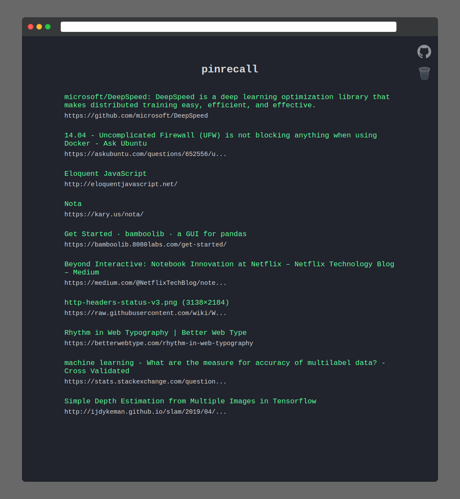

# pinrecall

Pinrecall is a Chrome extension that allows easy rediscovery 
of Pinboard bookmarks.

I built this to solve a problem that I face - bookmarking pages
only to never see them again. The extension is very simple and 
small (<120 lines of plain JavaScript). It takes over your new tab 
and displays ten random bookmarks from your Pinboard library. That's it.  

## Screenshot

## Usage
This extension will be available soon on the Chrome Webstore. You can also
install it by following these step - 
1. Download the repository as a zip file
2. Extract the zip
3. On Chrome, type `chrome://extensions` in the address bar and hit enter
4. Enable `Developer Mode`
5. Click `LOAD UNPACKED`
6. Browse to the extracted location, and select open
7. The extension should be installed now

After installation, open a new tab. You should see a prompt for Pinboard login.
This is where you'll need to enter your Pinboar API token. This is necessary to
fetch your bookmarks.  

To get the API token - 
1. Login to pinboard.in
2. Go to `settings` > `password`
3. Copy the token which looks like `username:xxxx`

Paste the token into the prompt on the new tab, and you're done! The first time you
login, it may take a few seconds to fetch the bookmarks and store them locally.
Subsequent loads should be instant. 

## Privacy 
All data is cached locally and resides inside your browser. There are no network 
calls except for fetching the bookmarks from Pinboard API.